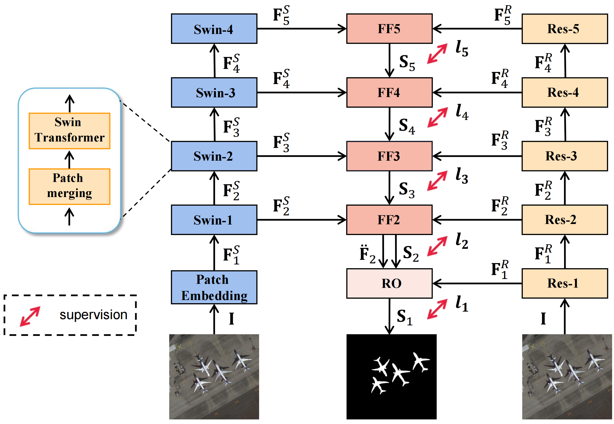
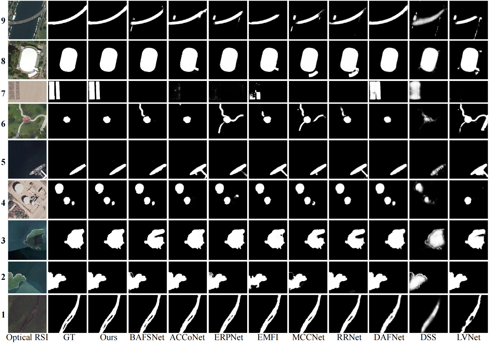

# ATCNet
**Aggregating Transformers and CNNs for Salient Object Detection in Optical Remote Sensing Images.**
 Liuxin Bao, Xiaofei Zhou, Bolun Zheng, Haibing Yin, Zunjie Zhu, Jiyong Zhang, and Chenggang Yan. Neurocomputing, 2023, 553: 126560.

## Prerequisites

## Usage

### 1. Clone the repository
```
https://github.com/Lx-Bao/ATCNet.git
```
### 2. Training

### 3. Testing

### 4. Evaluation

- We provide [saliency maps](https://pan.baidu.com/s/1AEoMaddDCn6CobGiUb5uVg?pwd=stvm) (fetch code: stvm) of our QSFNet on VDT-2048 dataset.


## Architecture


## Qualitative Comparison
### ORSSD


## Citation
```
@article{bao2023aggregating,
  title={Aggregating transformers and CNNs for salient object detection in optical remote sensing images},
  author={Bao, Liuxin and Zhou, Xiaofei and Zheng, Bolun and Yin, Haibing and Zhu, Zunjie and Zhang, Jiyong and Yan, Chenggang},
  journal={Neurocomputing},
  volume={553},
  pages={126560},
  year={2023},
  publisher={Elsevier}
}
```

- If you have any questions, feel free to contact me via: `lxbao@hdu.edu.cn` or `zxforchid@outlook.com`.
